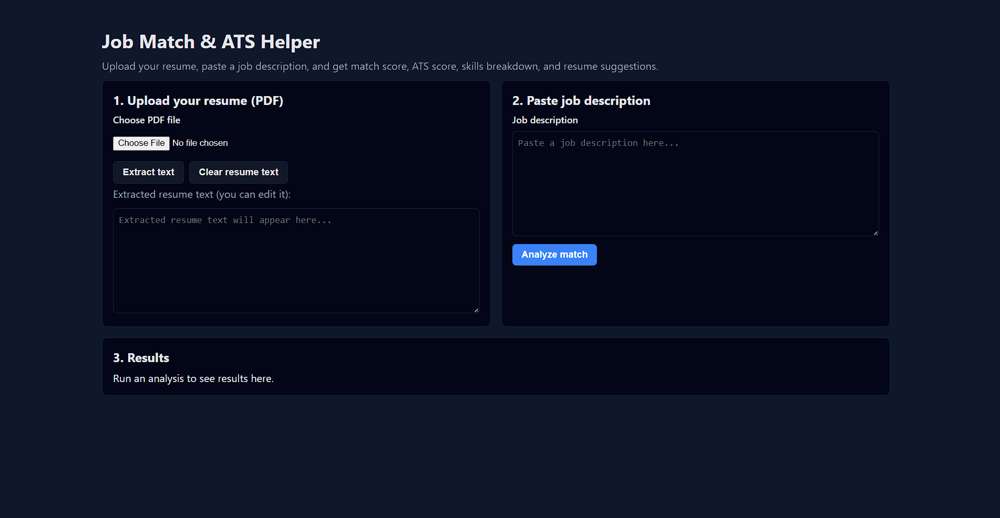
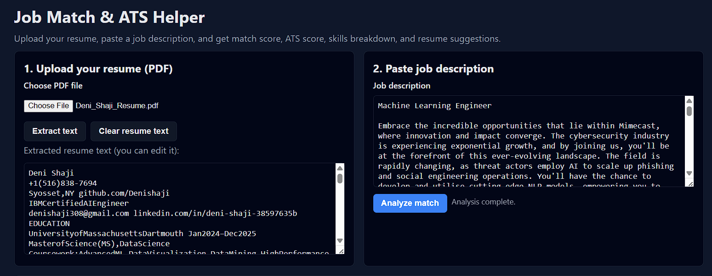
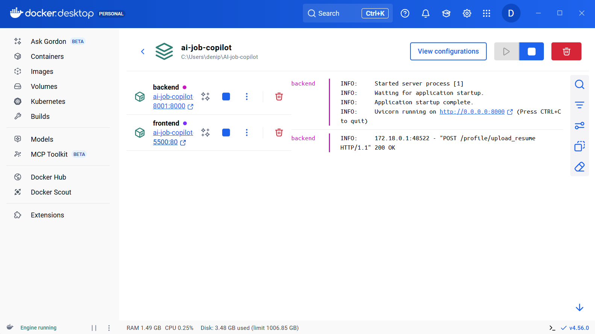
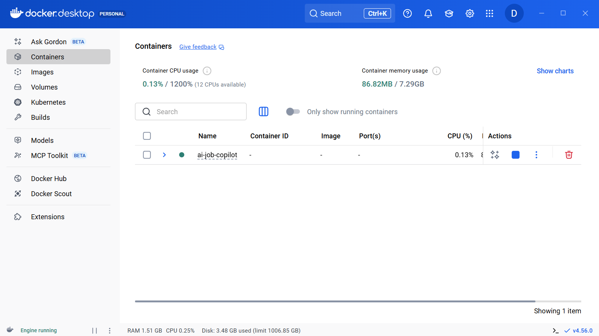

# Job Match & ATS Helper

Job Match & ATS Helper is a small end‑to‑end web app that helps you quickly check how well your resume matches a job description. Upload a PDF resume, paste a JD, and get a match score, ATS score, skills breakdown, and concrete resume suggestions in seconds.

---

## 1. UI preview

Main web UI:



Example analysis:



---

## 2. Features

- **PDF resume upload**
  - Upload a PDF file and extract clean text using `pdfplumber`.
  - Edit the extracted text in the UI before analysis.
- **Job description analysis**
  - Paste any job description (e.g., from LinkedIn, Indeed).
  - The backend compares the JD and resume text using an LLM.
- **Scoring & insights**
  - Overall match score (0–100) and ATS‑style score.
  - Matched skills vs missing skills.
  - Extra resume keywords and bullet‑point suggestions to improve the resume for that role.
- **Clean single‑page UI**
  - Dark theme layout with three sections: Upload resume, Paste JD, Results.
  - Built with plain HTML + CSS + vanilla JavaScript (no frameworks).
- **API‑first backend**
  - FastAPI backend with:
    - `/health` – health check.
    - `/profile/upload_resume` – PDF → text.
    - `/jobs/analyze` – JD + resume → JSON scores/skills/suggestions.
  - LangChain `ChatOpenAI` used for structured JSON output.
- **Docker support**
  - Backend and frontend run as separate services via `docker-compose`.
  - Reproducible local environment and easy demo story.

---

## 3. Tech stack

- **Backend**
  - FastAPI
  - LangChain
  - OpenAI ChatCompletion model
  - pdfplumber
  - Pydantic
- **Frontend**
  - HTML + CSS
  - Vanilla JavaScript (`fetch` API)
- **DevOps / Infra**
  - Docker
  - docker‑compose
  - Nginx (for serving static frontend files in Docker)

---

## 4. Project structure

```text
.
├─ backend/
│  ├─ app/
│  │  ├─ main.py                # FastAPI app, CORS, router include
│  │  ├─ routers/
│  │  │  ├─ health.py           # /health
│  │  │  ├─ profile.py          # /profile/upload_resume (PDF upload)
│  │  │  └─ jobs.py             # /jobs/analyze (JD + resume → analysis)
│  │  ├─ models/
│  │  │  ├─ job.py              # Job analysis request/response models
│  │  │  └─ profile.py          # Resume upload/response models
│  │  └─ core/
│  │     └─ llm.py              # get_llm() – LangChain ChatOpenAI config
│  ├─ requirements.txt          # Backend Python dependencies
│  └─ Dockerfile                # Backend image: Uvicorn + FastAPI
│
├─ frontend/
│  ├─ index.html                # Single-page UI
│  ├─ main.js                   # JS logic: calls backend APIs
│  ├─ styles.css                # Dark theme styles (if separate)
│  ├─ Web_UI.png
│  ├─ Analysis_Result.png
│  ├─ Docker_Compose_Stack.png
│  ├─ Bck_n_Frnt_Con.png
│  └─ Dockerfile                # Nginx static file server for frontend
│
├─ docker-compose.yml           # Orchestrates backend + frontend
└─ README.md
```

## 5. Running locally (plain Python)

This mode is ideal while actively developing the backend and frontend.

### 5.1 Prerequisites
*Python 3.11+

*pip and venv (or conda)

An OpenAI API key with access to ChatCompletion models

### 5.2 Backend setup
```bash
# From repo root
cd backend
# (Optional) create a virtual environment
python -m venv .venv
# Windows:
#   .venv\Scripts\activate
# macOS / Linux:
source .venv/bin/activate
```
 Install dependencies
pip install -r requirements.txt

 Set your OpenAI API key
 Windows PowerShell:
   $Env:OPENAI_API_KEY="your_api_key_here"
 macOS / Linux:
export OPENAI_API_KEY="your_api_key_here"
Run the FastAPI server on port 8001:

```bash
uvicorn app.main:app --reload --port 8001
```
You can verify it with:

*API docs: http://127.0.0.1:8001/docs

*Health check: http://127.0.0.1:8001/health

### 5.3 Frontend setup
In a separate terminal:

```bash
cd frontend
python -m http.server 5500
```
Open the UI at: http://localhost:5500

In this plain‑Python mode, frontend/main.js should use:
```bash 
const BACKEND_BASE_URL = "http://127.0.0.1:8001";
```
## 6. Running with Docker
If you prefer a fully containerized setup, you can run both services via Docker Compose.

### 6.1 Prerequisites
*Docker Desktop (or Docker Engine + docker‑compose)

*OpenAI API key

## 6.2 Environment
Export your API key in the shell (or put the same variable into a .env file read by Docker Compose):

```bash
# Windows PowerShell:
#   $Env:OPENAI_API_KEY="your_api_key_here"
# macOS / Linux:
export OPENAI_API_KEY="your_api_key_here"
```
### 6.3 Start the stack
From the repo root:
```bash
docker compose up --build
```
Open:
Frontend UI: http://localhost:5500
Backend docs (optional): http://localhost:8001/docs

Docker setup in Docker Desktop:



Backend & frontend containers:




## 6.4 Stop the stack
```bash
docker compose down
```
## 7. Development notes
*The LLM prompt and output schema live in the backend, so you can:
Adjust scoring logic.
*Add new fields (e.g., seniority estimate, interview questions, red flags).

Because the UI is plain HTML + JS, you can:

*Change the backend URL to point to any compatible API.

*Re‑use the same UI inside a Chrome extension later.

*Docker support makes it straightforward to:

*Run the app on another machine with minimal setup.

*Share a “clone, set API key, docker compose up” experience.

## 8. Roadmap / ideas
*Add authentication and user‑specific history.

*Support multiple resumes and choose the best one per JD.

*Integrate a browser extension to auto‑grab JDs from LinkedIn.

*Deploy a shared demo using a PaaS (Render, Fly.io, etc.) with BYO OpenAI key.

If you try this project and have feedback or ideas, feel free to open an issue or reach out.
